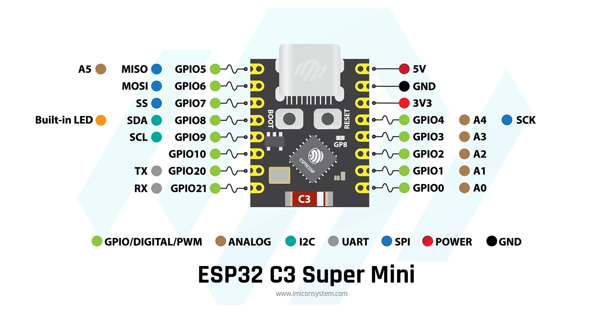

<div align="center">

```
╔══════════════════════════════════════════════════════════════════════════════╗
║                           iMac Dimmer Ubuntu v1.6.0                          ║
║                                                                              ║
║    🚀 Advanced ESP32-C3 Brightness Control with Dynamic IP Discovery         ║
║                                                                              ║
║    ✨ Features:                                                              ║
║    • Zero-maintenance network discovery   • Professional web interface       ║
║    • mDNS hostname support (*.local)      • Complete system integration      ║
║    • HTTP API with fallback mechanisms    • Keyboard shortcuts & automation  ║
║                                                                              ║
║    🔧 Hardware: ESP32-C3 SuperMini  |  🌐 Protocol: HTTP + mDNS + WiFi       ║
╚══════════════════════════════════════════════════════════════════════════════╝
```

</div>

# iMac Dimmer Ubuntu v1.6.0

A comprehensive solution for controlling iMac display brightness using ESP32-C3 with automatic network adaptation, multiple communication methods, and robust failover mechanisms.

## 🏗️ System Architecture

```
┌─────────────────┐    WiFi     ┌──────────────────┐    PWM    ┌─────────────────┐
│   Ubuntu PC     │◄───────────►│  ESP32-C3 Mini   │◄─────────►│  iMac Display   │
│                 │             │                  │           │   Brightness    │
│ • Python Script │             │ • Web Interface  │           │    Control      │
│ • Keyboard      │             │ • HTTP API       │           │                 │
│ • Systemd       │             │ • mDNS Service   │           │                 │
│ • Web Browser   │             │ • Version Track  │           │                 │
└─────────────────┘             └──────────────────┘           └─────────────────┘
         │                               │
         │ HTTP API                      │ imacdimmer.local
         │ imacdisplay.py -s 70          │ http://imacdimmer.local
         │                               │
         └───────────────────────────────┘
```

## ✨ Key Features

### 🌐 **Dynamic Network Discovery**
- **mDNS hostname**: Access via `imacdimmer.local` - no IP needed
- **Automatic IP discovery**: Finds ESP32 even when network changes
- **Multi-layer fallback**: MAC detection, network scanning, cached addresses
- **Zero maintenance**: Works across router reboots and DHCP changes

### 🔗 **Dual Communication Methods**
- **HTTP-based control**: Robust web API with `/serial` endpoint
- **Modern web interface**: Real-time brightness control with presets
- **ESP32-C3 compatible**: Bypasses bootloader serial communication issues
- **Version tracking**: Firmware verification and update management

### 🎛️ **Complete System Integration**
- **Keyboard shortcuts**: System-wide hotkey support
- **Systemd service**: Background brightness restoration
- **Auto-dimmer**: Automatic brightness reduction after idle time
- **Timer automation**: Scheduled brightness adjustments
- **Configuration caching**: Performance optimization with smart defaults

## 🔧 Hardware Requirements

<div align="center">
  
  <p><em>ESP32-C3 SuperMini Development Board</em></p>
</div>

### **Required Components:**
- **ESP32-C3 SuperMini Board** (shown above)
- **PCI-E 6-pin extension cable or splitter** (to intercept PWM signal)
- **USB cable** for ESP32
- **Basic soldering equipment**
- **Wire connectors** (optional, for easier connections)

### **Hardware Setup:**

1. **Access the LCD Driver Board**
   - Open the iMac and locate the LCD driver board
   - Identify the PCI-E 6-pin cable connected to the LCD

2. **Intercept the PWM Signal**
   - Cut the PWM wire on your extension cable (typically bottom right pin)
   - Connect the PWM wire to **GPIO3** on the ESP32
   - Ensure proper grounding between ESP32 and iMac

3. **Connect the ESP32**
   - Connect ESP32 to a USB port for power and programming
   - Use GPIO3 for PWM output (brightness control)
   - GPIO8 is used for status LED

4. **Additional Setup**
   - Install `mbpfan` for fan control: `sudo apt install mbpfan`
   - This prevents fan issues when intercepting the PWM signal

### **Board Specifications:**
- **Microcontroller**: ESP32-C3 (160MHz, 320KB RAM)
- **Flash Memory**: 4MB
- **WiFi**: 802.11 b/g/n (2.4GHz)
- **USB**: USB-C for programming and power
- **Size**: Ultra-compact form factor
- **GPIO**: 13 digital I/O pins
- **PWM Output**: GPIO3 (10kHz, 8-bit resolution)

## 📂 Project Structure

```
iMacDimmerUbuntu/
├── src/
│   └── main.cpp                    # ESP32 firmware v1.6.0
├── scripts/
│   ├── imacdisplay_http.py        # Smart discovery Python script
│   ├── auto_dimmer.py             # Automatic idle-time brightness dimmer
│   ├── test_auto_dimmer.py        # Auto-dimmer testing suite
│   ├── ping_test.py               # Network connectivity tests
│   └── hybrid_test.py             # Communication diagnostics
├── systemd/
│   ├── brightness.service         # System service configuration
│   └── auto-dimmer.service        # Auto-dimmer service configuration
├── DYNAMIC_IP_SOLUTION.md         # Detailed technical documentation
├── final_install.sh               # Automated installation script
├── install_auto_dimmer.sh         # Auto-dimmer installation script
├── platformio.ini                 # PlatformIO build configuration
└── README.md                      # This file
```

## 🚀 Quick Start

### **One-Command Installation**

```bash
# Clone and install everything automatically
git clone https://github.com/doobidoo/iMacDimmerUbuntu.git
cd iMacDimmerUbuntu

# Set up WiFi credentials
cp .env.example .env
# Edit .env with your WiFi credentials

./final_install.sh
```

The installation script will:
- ✅ Test ESP32 connectivity
- ✅ Configure optimal communication method
- ✅ Install system scripts with dynamic discovery
- ✅ Set up systemd service
- ✅ Verify complete functionality

## 📋 Manual Installation Steps

### 1. **Flash ESP32 Firmware**

```bash
# Set up WiFi credentials first
cp .env.example .env
# Edit .env with your WiFi SSID and password

# Build and upload v1.6.0 firmware
~/.platformio/penv/bin/platformio run --target upload
```

### 2. **Configure Network Access**

```bash
# Option A: Use mDNS hostname (recommended)
python3 scripts/imacdisplay_http.py --ip imacdimmer.local

# Option B: Auto-discover ESP32
python3 scripts/imacdisplay_http.py --discover

# Option C: Manual IP configuration
python3 scripts/imacdisplay_http.py --ip 192.168.1.100
```

### 3. **Install System Integration**

```bash
# Install system script
sudo cp scripts/imacdisplay_http.py /usr/local/bin/imacdisplay.py
sudo chmod +x /usr/local/bin/imacdisplay.py

# Install and start service
sudo cp systemd/brightness.service /etc/systemd/system/
sudo systemctl daemon-reload
sudo systemctl enable brightness.service
sudo systemctl start brightness.service
```

## 🎯 Usage Examples

### **Command Line Interface**

```bash
# Brightness control
imacdisplay.py -s 70          # Set to 70%
imacdisplay.py -g             # Get current brightness
imacdisplay.py -i 10          # Increase by 10%
imacdisplay.py -d 10          # Decrease by 10%

# System diagnostics
imacdisplay.py -v             # Get firmware version
imacdisplay.py --ping         # Test ESP32 connectivity
imacdisplay.py --discover     # Find and save ESP32 location

# Network configuration
imacdisplay.py --ip imacdimmer.local    # Use hostname
imacdisplay.py --ip 192.168.1.27        # Use specific IP
```

### **Web Interface**

<div align="center">
  <table>
    <tr>
      <td><strong>🌐 Access Methods</strong></td>
      <td><strong>🎛️ Interface Features</strong></td>
    </tr>
    <tr>
      <td>
        • <code>http://imacdimmer.local</code> (recommended)<br>
        • <code>http://[ESP32-IP-ADDRESS]</code><br>
        • Auto-discovery enabled
      </td>
      <td>
        • 🎚️ Real-time brightness slider<br>
        • 🎯 Quick preset buttons (5%, 20%, 50%, 70%, 100%)<br>
        • 📊 System information display<br>
        • 📡 WiFi status and signal strength<br>
        • 🔄 Firmware version verification
      </td>
    </tr>
  </table>
</div>

### **Keyboard Shortcuts**

Configure in your desktop environment:

| Action | Command |
|--------|---------|
| **Brightness Up** | `imacdisplay.py -i 10` |
| **Brightness Down** | `imacdisplay.py -d 10` |
| **Preset Dim** | `imacdisplay.py -s 20` |
| **Preset Bright** | `imacdisplay.py -s 80` |

### **Auto-Dimmer (Idle Time Control)**

Automatically dims the display after a period of inactivity:

```bash
# Install and test auto-dimmer
./install_auto_dimmer.sh

# Test functionality safely
python3 scripts/test_auto_dimmer.py

# Manual control options
auto_dimmer.py --minutes 10 --level 5    # Dim to 5% after 10 minutes
auto_dimmer.py --status                   # Show current status
auto_dimmer.py --test                     # Test idle detection

# Enable as system service
sudo systemctl enable auto-dimmer.service
sudo systemctl start auto-dimmer.service
```

**Auto-Dimmer Features:**
- 🕐 **Configurable idle timeout** (default: 10 minutes)
- 🌙 **Safe minimum brightness** (default: 5%, never completely dark)
- 👋 **Activity detection** (restores brightness when user returns)
- 💾 **Configuration persistence** (remembers settings)
- 🔄 **Graceful recovery** (restores brightness on shutdown)

## 🔧 Configuration

### **WiFi Credentials**

WiFi credentials are now managed through environment variables for security:

1. **Create a `.env` file** in the project root:
   ```bash
   cp .env.example .env
   ```

2. **Edit `.env`** with your WiFi credentials:
   ```
   WIFI_SSID=YourWiFiNetwork
   WIFI_PASSWORD=YourWiFiPassword
   ```

3. **Build and flash** - credentials are injected at build time:
   ```bash
   ~/.platformio/penv/bin/platformio run --target upload
   ```

**Note**: The `.env` file is gitignored to prevent accidental credential exposure.

### **Network Discovery Methods**

The system automatically tries (in order):

1. **mDNS Hostname**: `imacdimmer.local`
2. **Cached Address**: Last known working connection
3. **ARP Table Scan**: ESP32 MAC address detection
4. **Network Discovery**: Intelligent local network scanning
5. **Manual Configuration**: User-specified addresses

## 🔐 Security Considerations

### **WiFi Credentials Management**
- ✅ Credentials stored in `.env` file (not in source code)
- ✅ Environment variables injected at build time
- ✅ `.env` file excluded from git repository
- ✅ Example template provided (`.env.example`)

**Important**: If you've previously committed credentials to git, change your WiFi password immediately as git history retains old commits.

## 🛡️ Safety & Reliability Features

### **Hardware Safety**
- ✅ Minimum brightness enforcement (5%)
- ✅ Safe startup brightness (70%)
- ✅ PWM output protection
- ✅ Status LED feedback

### **Network Resilience**
- ✅ Automatic WiFi reconnection
- ✅ mDNS service registration
- ✅ HTTP communication redundancy
- ✅ Configuration caching and recovery

### **System Integration**
- ✅ Systemd service with auto-restart
- ✅ Background brightness restoration
- ✅ Non-blocking communication timeouts
- ✅ Graceful degradation on failures

## 🔍 Troubleshooting

### **Network Connectivity**

```bash
# Test ESP32 discovery
python3 scripts/hybrid_test.py

# Test hostname resolution
ping imacdimmer.local

# Manual connectivity test
curl http://imacdimmer.local/version
```

### **System Service**

```bash
# Check service status
systemctl status brightness.service

# View service logs
journalctl -u brightness.service -f

# Restart service
sudo systemctl restart brightness.service
```

### **Firmware Issues**

```bash
# Check web interface
curl http://imacdimmer.local/version

# Verify firmware version
python3 scripts/imacdisplay_http.py -v

# Re-flash firmware if needed
~/.platformio/penv/bin/platformio run --target upload
```

## 🌐 Network Compatibility

### ✅ **Fully Compatible**
- Home networks with standard routers
- Networks with mDNS/Bonjour support
- Standard DHCP configurations
- Multi-VLAN setups with local access

### ⚠️ **Limited Compatibility**
- Corporate networks with mDNS blocked
- Networks with restricted ARP access
- Very strict firewall configurations

**Workaround**: Use manual IP configuration:
```bash
imacdisplay.py --ip [actual-esp32-ip]
```

## 🚀 Advanced Features

### **API Endpoints**

The ESP32 provides a RESTful API:

```bash
# Version information
GET /version

# WiFi and system status
GET /wifistatus

# Serial command emulation
GET /serial?cmd=version
GET /serial?cmd=get
GET /serial?cmd=50

# LED control
GET /led?pin=8&state=1

# Direct brightness control
GET /brightness?level=128
```

### **Configuration Management**

Settings are automatically cached in `~/.config/imacdisplay.conf`:

```json
{
  "esp32_ip": "imacdimmer.local",
  "last_brightness": 70
}
```

## 📊 Technical Specifications

| Component | Specification |
|-----------|---------------|
| **Microcontroller** | ESP32-C3 (160MHz, 320KB RAM) |
| **WiFi** | 802.11 b/g/n, 2.4GHz |
| **PWM Output** | GPIO3, 10kHz frequency, 8-bit resolution |
| **Communication** | HTTP/1.1, mDNS, WebSocket ready |
| **Power** | USB-C, 3.3V operation |
| **Flash Memory** | 4MB with OTA support |

## 🤝 Contributing

1. Fork the repository
2. Create a feature branch
3. Make your changes
4. Test thoroughly with `python3 scripts/hybrid_test.py`
5. Submit a pull request

## 📄 License

This project is open source. See the repository for license details.

## 📚 Hardware References

### **Wiring Diagrams & Guides**
- **PCI-E 6-pin Pinout**: Standard pinout for LCD driver connections
- **PWM Signal Location**: Bottom right pin on the 6-pin connector
- **Detailed Wiring Guide**: [iMac GPU Upgrade & ESP32 PWM Brightness Fix](https://medium.com/@fixingthings/imac-2009-2010-2011-gpu-upgrade-fixing-led-lcd-pwm-brightness-with-an-esp32-bc32da61a0e7)

### **Safety Notes**
- Always disconnect power before working on hardware
- Use proper grounding to prevent static damage
- The PWM signal is typically 3.3V compatible
- Test connections before final assembly

## 🎉 Acknowledgments

- **ESP32 Community**: For comprehensive hardware support
- **PlatformIO**: For excellent development environment
- **mDNS/Avahi**: For network service discovery
- **mbpfan Project**: For iMac fan control solution

---

**🔗 Links**
- **Repository**: [github.com/doobidoo/iMacDimmerUbuntu](https://github.com/doobidoo/iMacDimmerUbuntu)
- **Technical Details**: [DYNAMIC_IP_SOLUTION.md](DYNAMIC_IP_SOLUTION.md)
- **Latest Release**: [v1.6.0](https://github.com/doobidoo/iMacDimmerUbuntu/releases/tag/v1.6.0)
- **Hardware Wiring Guide**: [Medium Article by @fixingthings](https://medium.com/@fixingthings/imac-2009-2010-2011-gpu-upgrade-fixing-led-lcd-pwm-brightness-with-an-esp32-bc32da61a0e7)

*Built with ❤️ for the ESP32 and open source communities*
